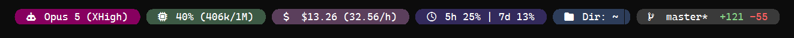
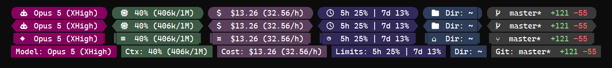

# claude-statusline

A status line for [Claude Code](https://claude.com/claude-code). One binary, no dependencies.



## Install

**macOS / Linux**

```sh
curl -fsSL https://raw.githubusercontent.com/PouriahLabs/claude-statusline/main/install.sh | sh
```

**Windows** — in PowerShell (`irm` is a PowerShell command; Command Prompt
will say it isn't recognised):

```powershell
irm https://raw.githubusercontent.com/PouriahLabs/claude-statusline/main/install.ps1 | iex
```

<details>
<summary>Already in Command Prompt?</summary>

```
powershell -NoProfile -Command "irm https://raw.githubusercontent.com/PouriahLabs/claude-statusline/main/install.ps1 | iex"
```
</details>

The installer downloads the binary, then runs a short setup that picks your icon
style, offers a Nerd Font, and wires itself into `~/.claude/settings.json`.
Anything that changes a file you already have asks first and writes a backup.

**Restart Claude Code and you're done.**

> On **macOS and Linux**: the bar itself is covered by CI on both, but the
> installer, font install and terminal patching are developed on Windows and
> have not been run on real hardware there — see [Status](#status). If
> something looks wrong, `claude-statusline doctor` says what.

<details>
<summary>Install it yourself instead</summary>

```sh
go install github.com/PouriahLabs/claude-statusline@latest
```

Or download a binary from [releases](https://github.com/PouriahLabs/claude-statusline/releases).

Then run `claude-statusline init`, or skip the wizard and add this to
`~/.claude/settings.json` by hand:

```json
{ "statusLine": { "type": "command", "command": "/path/to/claude-statusline" } }
```

On Windows, escape the backslashes: `"C:\\Users\\you\\...\\claude-statusline.exe"`.
</details>

<details>
<summary>Uninstall</summary>

```sh
claude-statusline uninstall
```

Unwires itself from `~/.claude/settings.json` (backing it up first, and leaving
it alone if you've since pointed `statusLine` at something else), then removes
its config and cache. It prints the path to the binary rather than deleting it,
and keeps any font it installed — that's a normal font you may still want.
</details>

## What you're looking at

The bar at the top of this page, left to right:

| Pill | Shows |
|---|---|
| **Model** | Model and reasoning effort |
| **Context** | Context used — corrected, see [notes](#notes) |
| **Cost** | Session cost, and burn rate while working |
| **Limits** | Subscription quota, 5-hour and weekly |
| **Dir** | Current folder, `~` for home |
| **Git** | Branch, dirty flag, ahead/behind, session diff |

Pills with nothing to say are dropped, so a fresh session starts short and grows.

Context and quota go amber, then red, as they fill:


40% / 62% / 88% context. The quota pill's background never changes — the
**numbers** carry severity, and each window is coloured independently, so
"5-hour nearly spent, weekly barely touched" doesn't look the same as "both at
88%". An elevated window also gets a reset countdown (`5h 91% ·4h25m`).

The model pill tracks reasoning effort:


Grey → teal-blue → royal blue → magenta → pink for low → max. No amber or red:
those belong to the two meters that can actually run out, and this pill sits
right next to the context one. Every step is
[distance-checked](docs/DESIGN.md#separation-is-measured-not-eyeballed) against
the other pills.

## No Nerd Font? Still works

The bar has three tiers. `init` opens by asking whether you want icons at all —
answer `text` and you get plain labels, no font detection, no install offer:

```
Model: Opus 5 (XHigh)   Ctx: 40% (406k/1M)   Cost: $13.26 (32.56/h)   …
```

Answer `icons` and it shows you each glyph tier and asks which renders properly
— there's no reliable way for a program to detect that.



Nerd Font, Unicode symbols, plain ASCII labels. The bottom two need no font
install; the bottom row works in any terminal at all. Set it directly with
`icons = "ascii"` (pair with `caps = "none"`), or run `claude-statusline
preview` any time to compare the tiers yourself.

## Configure

Optional — the defaults are what you see above. `claude-statusline init` writes
a config, or edit it directly:

| Platform | Path |
|---|---|
| Linux | `~/.config/claude-statusline/config.toml` |
| macOS | `~/Library/Application Support/claude-statusline/config.toml` |
| Windows | `%APPDATA%\claude-statusline\config.toml` |

```toml
order = ["model", "context", "cost", "limits", "dir", "git"]

[display]
icons = "nerd"    # nerd | unicode | ascii
caps  = "round"   # round | arrow | block | none

[theme]
limits = "#332a5c"
dir    = "#2d3d5a"
```

Your file layers over the defaults, so write only what you're changing — and
`init` writes it that way too, recording just the answers you gave. Anything
you leave out keeps following the built-in default, including when a later
release changes it. Full reference:
[`config.example.toml`](config.example.toml). Colours take `#rrggbb` or a
0–255 palette index, and downgrade automatically on 256- and 16-colour
terminals.

On a 256-colour terminal the palette simply has no dark, muted entries — its
cube steps 0, 95, 135 — so the theme can only be approximated, and two pills
may land on the same colour. `[theme_256]` pins an index per key to break a
tie; the shipped theme uses it for `limits`. A truecolor terminal has none of
this. If the bar looks wrong rather than absent, `claude-statusline doctor`
reports a config that failed to parse — one bad key falls back to *all* the
defaults.

**Commands:** `init` (setup) · `preview` (compare tiers) · `doctor` (check the
Claude Code wiring, diagnose config, audit contrast) · `uninstall` · `help`

Installed it but the bar doesn't appear? Run `claude-statusline doctor` — it
exits non-zero and tells you what to fix.

## Notes

**It corrects the context percentage.** Claude Code reports a 200k window even
for models whose real window is 1M, so its own figure runs ~5× high — a session
actually at 11% displays as 58%. This computes from the raw token count against
a per-model window. Unknown models fall back to the reported value.

**It ignores `NO_COLOR`.** Claude Code sets it for subprocesses, and honouring
it would strip the colour from a bar you installed for its appearance. Set
`color = "none"` if you want that.

<details>
<summary>More on refresh timing, quota countdowns and ultracode</summary>

**Nothing updates on a timer.** Claude Code re-runs the status line when it
repaints, which is driven by activity — measured gaps ranged from 0.5s to 49s,
and while you're idle it doesn't repaint at all. Cost moves when a turn
completes.

**Quota percentages are integers**, and one turn is often well under 1% of a
five-hour budget, so they can sit still for many turns. That's why an elevated
window also shows its reset countdown: 64% with hours to go is a problem, 64%
with eight minutes to go isn't. Control it with `limits_reset`.

**Ultracode is only partly detectable.** It's a session flag that forces effort
to xhigh, and it doesn't appear in the status line's input at all. The `Ultra`
marker shows only if `ultracode` is set in `~/.claude/settings.json` or
`CLAUDE_STATUSLINE_ULTRACODE=1`. Per-prompt use leaves no trace.

**Git is cached** for 2s by default — three `git` calls per repaint measured
~85 ms on a real repo. Tune with `git_cache`.
</details>

More on the design decisions — colour contrast, why the quota pill works the way
it does — in [DESIGN.md](docs/DESIGN.md).

## Status

**1.0.** The config file and the CLI are stable: keys keep working, and
anything that would break them gets a major version, not a quiet change. Your
config is written as a set of deltas over the defaults, so improvements to the
parts you didn't set continue to reach you.

Developed and used daily on **Windows**. CI builds and tests on Windows, macOS
and Linux (amd64 + arm64), and the renderer is platform-independent and covered
by tests — but the font installer, terminal patcher and install scripts have
**not been run on real macOS or Linux hardware**. That is the honest edge of
this release: the bar is solid everywhere, the *setup path* has only been
proven on Windows. Reports from those platforms are the ones I most want.

**Claude Code only, for now.** Codex CLI has no external-command contract for
its status line, so there is nothing to point this at —
[openai/codex#17827](https://github.com/openai/codex/issues/17827) is the open
request.

**Updates are manual.** Nothing checks for or announces a new release — watch
the repo, or re-run the installer.

Planned work, none of it implemented, is in [ROADMAP.md](docs/ROADMAP.md).

## License

MIT
