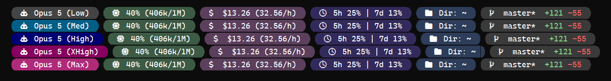
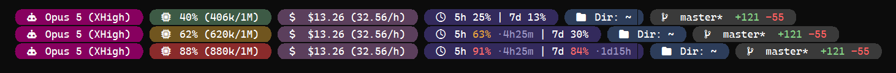

# Design notes

The reasoning behind the defaults. None of this is needed to use the tool — see the [README](../README.md) for that.

## Why setup is interactive

Three things must be true for the Nerd Font icons to render, and a program can only do the first:

1. **The font is installed.** Fully automatable, and `init` does it — per-user, no admin, registered correctly per OS.
2. **The terminal is set to use it.** Every terminal stores this differently, and some (Terminal.app, iTerm2) only expose it in a GUI. `init` patches the ones it safely can, after asking, and prints the exact snippet for the rest.
3. **The glyphs actually render.** There is no portable way to query a font's glyph coverage. None.

So `init` prints the icons and asks whether you can see them. Anything claiming to detect this automatically is guessing.

`init` refuses to rewrite any JSON file containing `//` comments, and prints the snippet instead — VS Code's `settings.json` is almost always commented, and a JSON round-trip would silently delete those comments. Every mutation writes a timestamped backup first.

## Colour

Two rules drive the palette.

**Alarms must not harmonise.** The `ok` state of each meter is muted so it blends into the bar; `warn` and `crit` get progressively louder. A warning colour that sits politely in the palette is a broken warning.

**Effort is a mode, not a warning.** The model pill runs grey → teal-blue → royal blue → magenta → pink for low → max, deliberately avoiding amber and red. Those belong to the two meters that can actually run out — and the model pill sits directly beside the context pill, so sharing a colour there would be actively misleading.

### Separation is measured, not eyeballed

`high` was originally violet `#5a3f8a`, which measured **15.3** perceptual distance from the cost pill's plum `#5b3f5c` — effectively the same colour. It was also within 35 of five other pills, because the bar already carries slate, indigo, plum and two greys, and violet landed in the middle of them.

Replacing it meant scoring candidates against two separate constraints:

1. **The five pills visible simultaneously** (context, cost, limits, dir, git). This is the side-by-side test.
2. **The neighbouring effort steps.** Only one effort colour is on screen at a time, but a level you switch *to* should visibly differ from the one you left.

That second test is what ruled out dark cyan `#00666b`, which scored a respectable 36.9 on the first but only **10.7** against `medium` — switching medium → high would have looked like nothing happened. Royal blue `#000075` scores 43.5 and 73 respectively.

The same weighted-RGB distance function the renderer uses for its 256-colour downgrade does this scoring, so "distinct" means the same thing in both places.





### Contrast

Every default is measured. `claude-statusline doctor` audits your theme:

```
contrast of white text on each pill (AAA = 7.0):
  model/low      #444444   9.74
  model/medium   #005f87   7.03
  model/high     #000075  16.71
  model/xhigh    #87005f   9.57
  model/max      #b02a7a   6.07  (AA, below AAA)
  context/ok     #3d5a45   7.65
  context/warn   #70551f   6.98  (AA, below AAA)
  context/crit   #8a2b2b   8.53
  cost           #5b3f5c   9.09
  limits         #332a5c  12.91
  dir            #2d3d5a  10.90
  git            #3a3a3a  11.37
```

The tool holds itself to WCAG **AAA** (7.0:1) rather than AA (4.5:1), because the AA threshold assumes text far larger than a terminal font. In practice a pill at 4.5 reads as washed out at 12pt.

**Foreground colour must be measured against the pill, not the terminal.** This is the rule that produced the current limits palette, and it was learned the hard way: the severity numbers are drawn *on* the indigo pill, and against the original `#463c78` they scored 4.47 (amber) and 3.47 (red) — both below AA. A recoloured percentage got *harder* to read, which is exactly backwards.

The fix was to darken the background (`#332a5c`) rather than lighten the text. Lightening the text also clears the bar numerically, but a pastel red stops reading as an alarm — it passes the check and fails the job.

The same constraint applies to any pill whose meaning lives in the foreground: the git pill's `+N`/`-N` counts, and the quota percentages. Those two need low-chroma backgrounds. The model, context, cost and directory pills carry plain white text, so saturated backgrounds are free there.

## Why the quota pill never changes colour

The quota pill keeps one fixed background and puts severity on the individual numbers.

A background ramp was wrong twice over. Sharing the context meter's amber and red made the two pills look identical whenever both crossed a threshold. And collapsing 5h and 7d into a single `max()` colour hid the case where one window is nearly spent and the other is fine — which is most of the time, and is precisely the thing you want to know.

The git pill already worked this way (`+121` green, `-55` red on neutral grey). This is the same idea applied consistently.

## Rendering

**Output is raw UTF-8 written straight to stdout.** The icons are astral private-use codepoints (`U+F06A9` is two UTF-16 units). Any path that re-encodes through a legacy codepage turns each one into `??` — this is a real failure mode, observed in the PowerShell prototype where `Write-Host` routed through the host UI and the ANSI codepage mapped every unrepresentable unit to `?`.

**Colour degrades** truecolor → 256 → 16 → none, matched in CIELAB rather than in RGB. The metric matters more than it looks: an earlier version weighted RGB by the NTSC luma coefficients, which measure brightness rather than colour difference and discount blue about ninefold against green. The xterm palette holds 24 greys in steps of 10 but a colour cube in steps of 40–95, so under a brightness metric every dark, muted colour finds a grey nearer than any coloured entry — five of the six pill backgrounds collapsed to the same grey, and the bar rendered monochrome on any 256-colour terminal. macOS Terminal.app is the common one, since it reports 256 colours and no truecolor.

The 256-colour search also starts at index 16. The basic sixteen are whatever the user's terminal theme says they are, so matching into that range makes a hex colour render differently under every colour scheme. Everything from 16 up is fixed by the xterm specification.

**Git state is cached** behind a short TTL. Three `git` invocations per repaint measured ~85 ms on a real repository, and the status line repaints constantly. The cache is a temp file keyed by repo path, written via write-then-rename so a concurrent reader never sees a partial file.

## The screenshots

`tools/screenshot.ps1` runs the real binary, parses the ANSI it emits, and rasterises it with the installed Nerd Font. The images are genuine output, not mockups. `docs/hero-terminal.png` is an unretouched terminal capture, kept in the repo as a cross-check against the rasteriser.

Two things the rasteriser has to do that a terminal does for free: lay out on a fixed cell grid (GDI+ under-measures multi-character runs), and draw the powerline caps as geometry rather than glyphs (GDI+ doesn't clip glyph ink to the cell, so the caps bleed sideways and swallow the gap between pills).
